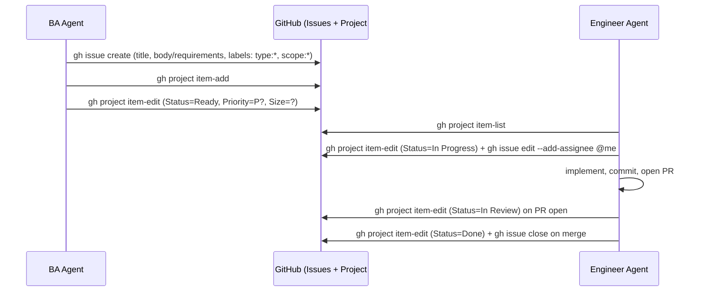

# Agent-Driven Project Management (GitHub Issues + Projects v2)

> **Superseded.** This draft's good ideas (the real board reference, the Status-includes-Ready
> model, `scope:`-prefixed labels, role-scoped scripts) were merged into the actual implementation.
> See `AGENTS.md` → "Product Backlog (GitHub Issues & Projects)" and `tools/github/` for what's
> actually built and current. Kept here as historical context, not as a guide to follow.

**Status: design proposal — not yet implemented.**

## Goal

Let a **BA agent** create and groom work items (tickets) with requirements, and let an **engineer
agent** discover ready work, pick it by priority, and update status as it progresses — all through
`git`/`gh` from the terminal, no human copy-pasting between chat and GitHub.

- Project board: `https://github.com/users/jmbilizi/projects/7` (user-level, scoped to this repo).
- Repo: `jmbilizi/real-estate-platform`.

## Is this possible?

Yes. Two GitHub surfaces cover everything needed:

| Capability                                    | Tool                                                                |
| --------------------------------------------- | ------------------------------------------------------------------- |
| Issue CRUD (create/read/update/close/comment) | `gh issue create/list/view/edit/close/comment` or REST API          |
| Project v2 CRUD (items, custom fields)        | `gh project item-add/item-edit/item-list/field-list` or GraphQL API |

The `gh` CLI covers ~90% of this. The remaining 10% (setting a single-select field's value) requires
resolving field IDs and option IDs via `gh project field-list --format json`, then passing those IDs
to `gh project item-edit --field-id ... --single-select-option-id ...` (or the equivalent GraphQL
mutation) — the CLI doesn't accept human-readable field/option names for this operation.

## Prerequisites

1. **`gh` CLI installed** on any machine/CI runner running these scripts (not currently installed
   locally — verified via `gh --version` returning "not recognized").
2. **Auth token**: a **classic** PAT with `repo` + `project` scopes, exported as `GH_TOKEN`.
   - Classic PATs are used (not fine-grained) because fine-grained tokens have historically had gaps
     in Projects v2 GraphQL support — worth re-verifying against current GitHub docs before rollout.
   - `gh` auto-detects `GH_TOKEN` (or `GITHUB_TOKEN`) from the environment — no interactive
     `gh auth login` needed for agent/CI use.
   - Never commit the token. Store it in a local `.env` (already gitignored) for local agent runs,
     and as an Actions secret for CI-driven automation.

## Project field schema (to confirm/create on project #7)

Agents need a stable, queryable contract. Proposed single-select fields on the project:

| Field      | Values                                                     | Set by                                         |
| ---------- | ---------------------------------------------------------- | ---------------------------------------------- |
| `Status`   | `Backlog` → `Ready` → `In Progress` → `In Review` → `Done` | BA sets `Ready`; engineer agent moves the rest |
| `Priority` | `P0`, `P1`, `P2`, `P3`                                     | BA agent                                       |
| `Size`     | `XS`, `S`, `M`, `L`, `XL`                                  | BA agent (optional, for planning)              |

`Type` and `Scope` are better modeled as **labels** (see below) since labels are native to Issues,
searchable via `gh issue list --label`, and don't require project field ID lookups.

## Label taxonomy (mirrors the existing Nx auto-tag dimensions for consistency)

| Prefix   | Examples                                                      | Meaning                                                             |
| -------- | ------------------------------------------------------------- | ------------------------------------------------------------------- |
| `type:`  | `type:feature`, `type:bug`, `type:chore`                      | Kind of work                                                        |
| `scope:` | `scope:account-service`, `scope:cribstop-web`, `scope:shared` | Business/domain area — align with Nx `scope:` tags where applicable |

Readiness is expressed via `Status: Ready` on the project item, not a label — so "ready to work" is
a single, unambiguous signal.

## Workflow contract



**Priority ordering rule for engineer agents**: query all items with `Status=Ready`, sort by
`Priority` (`P0` first), break ties by issue creation date (oldest first, FIFO). Never start `P2`
work while `P0`/`P1` items are `Ready` and unassigned.

## Proposed repo tooling (per `tools/` convention — wrap raw CLI, don't call it directly)

Following this repo's existing pattern (`tools/infra/run-skaffold.js` wraps `skaffold`,
`tools/nx/safe-run-many.js` wraps `nx`), add a `tools/github/` directory:

```
tools/github/
├── lib/
│   └── gh-client.js          # shared spawnSync wrapper: checks GH_TOKEN, JSON parsing, error surface
├── discover-fields.js        # one-time: dumps field/option IDs for project #7 to project-fields.json
├── project-fields.json       # cached field & option node IDs (regenerate if board schema changes)
├── create-issue.js           # BA agent: create issue + add to project + set Status/Priority/Size
├── list-ready-work.js        # Engineer agent: list Status=Ready items sorted by Priority, as JSON
├── claim-issue.js            # Engineer agent: assign self, Status=In Progress, post claim comment
└── complete-issue.js         # Engineer agent: Status=Done, close issue, post summary comment
```

Corresponding `package.json` script aliases (own section, matching existing `// Comment` style):

```jsonc
"// GitHub Project Management": "",
"github:issue:create": "node tools/github/create-issue.js",
"github:work:list": "node tools/github/list-ready-work.js",
"github:work:claim": "node tools/github/claim-issue.js",
"github:work:complete": "node tools/github/complete-issue.js",
```

## Optional: auto-add automation

A lightweight GitHub Action (`.github/workflows/project-auto-add.yml`) using
`actions/add-to-project` can auto-attach every new issue to project #7 with `Status: Backlog`, so
the BA agent only has to promote it to `Ready` rather than doing the attach step manually. Requires
a PAT stored as an Actions secret (classic `gh`-created token, `project` scope) since the default
`GITHUB_TOKEN` cannot write to user-level Projects v2.

## Security notes

- Scope the PAT to `repo` + `project` only — no `admin:org`, no `workflow` unless actually needed.
- Treat `GH_TOKEN` like any other secret: never printed to logs, never in committed files.
- Rate limits: `gh` calls count against the standard REST/GraphQL rate limit (5,000/hr
  authenticated) — fine for agent-driven ticket flow, but batch reads (`list-ready-work.js`) rather
  than polling in a tight loop.
- Engineer agents should only ever be granted enough scope to update status/comments/PRs on issues
  assigned to them — not to delete issues or modify the project schema. Enforce this at the _script_
  level (`complete-issue.js` etc. only ever call the specific mutations they need), not by trusting
  the agent's prompt alone.

## Open questions before implementation

1. Confirm `Status`/`Priority`/`Size` field names and option values already on project #7 (or create
   them if the board is empty) — `discover-fields.js` will need real field IDs either way.
2. Decide where `GH_TOKEN` is sourced from for local agent runs (`.env` file convention already used
   elsewhere in this repo?) vs. CI (Actions secret name).
3. Confirm whether the engineer agent should open PRs and link them to the issue automatically
   (`gh pr create --body "Closes #123"`) as part of `complete-issue.js`, or leave PR creation as a
   separate manual/agent step.
